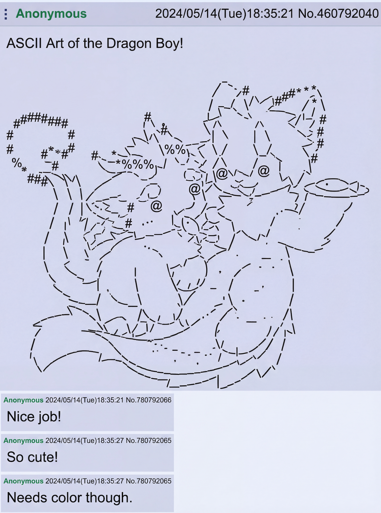
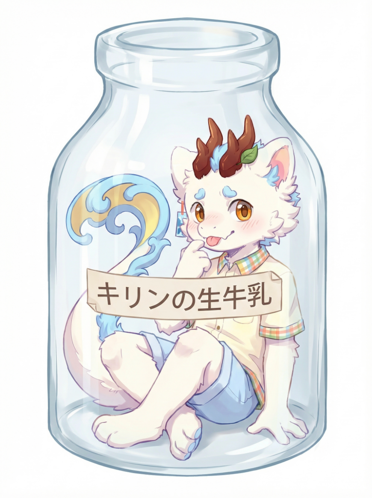
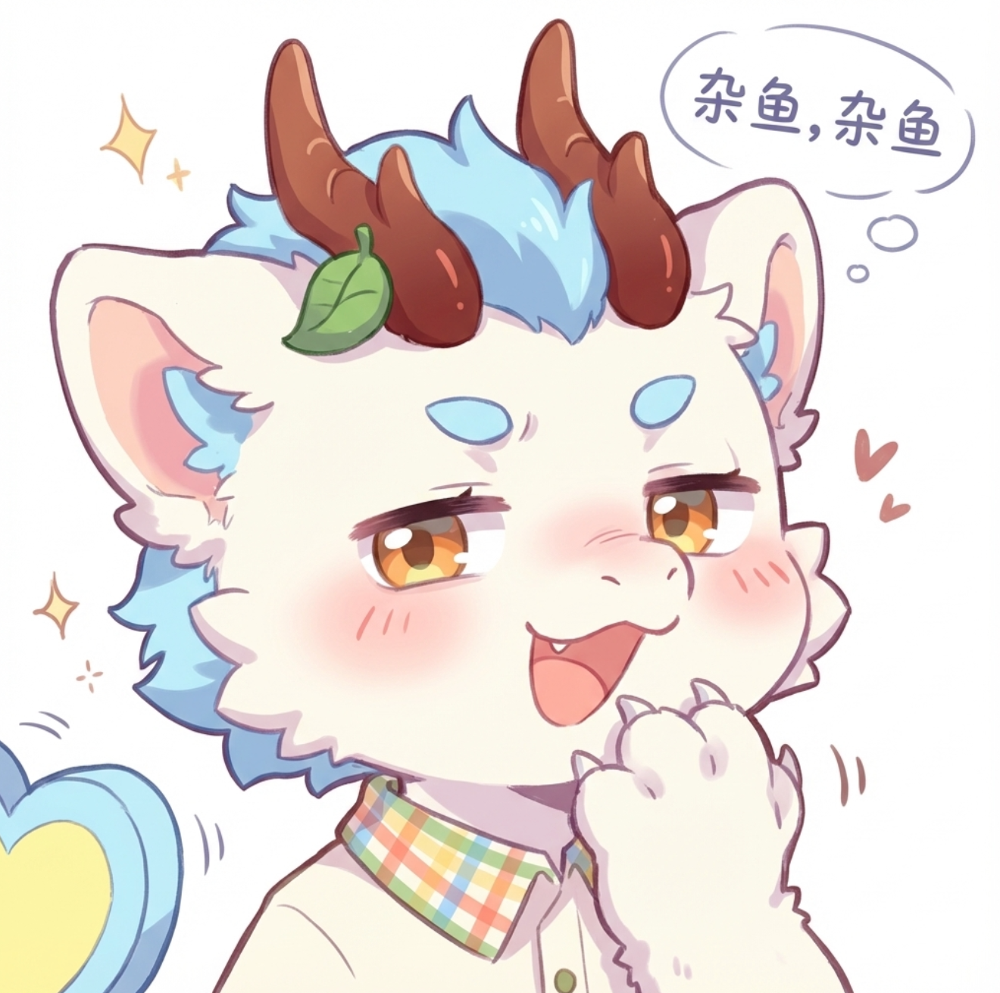
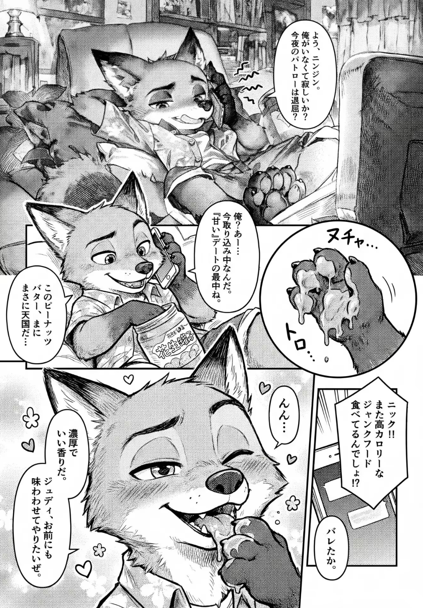

<a id="cases-toc"></a>
## 📖 Cases Directory

*   [No. 1: Mofu Mofu Transformation (Photographer)](#cases-1)
*   [No. 2: ASCII Art](#cases-2)
*   [No. 3: Milk Bottle Art](#cases-3)
*   [No. 4: Milk Carton Advertisement](#cases-4)
*   [No. 5: Chalk Art on Blackboard](#cases-5)
*   [No. 6: Galgame Hotspring Scene](#cases-6)
*   [No. 7: Chibi Teasing Emoji](#cases-7)
*   [No. 8: Manga Page - Nick Wilde Peanut Butter](#cases-8)

---

<a id="cases"></a>
## 🧩 No.

<a id="cases-1"></a>
### No. 1: Mofu Mofu Transformation (Photographer)

<br>
<sub>Credit: [与纸Yuzhi](https://github.com/Yuzhifur)</sub>


**Prompt**

```
Create a four-step transformation chart showing how the same character evolves from a quadrupedal fluffy creature into a human boy with furry ears.  
Make each step aligned from left to right. Space the four steps tightly rather than loosely, design certain overlapping between them.
Arrange the four figures be front facing, but with different tilts to the left or right, avoid having them all tilted to left or right. For example: [right, left, right, left]
Add a long horizontal arrow at the bottom with tick marks labeled 1, 2, 3, 4 as the legend.  

Include a hanging bookmark tag in the top-left corner with a hand-drawn look, slightly bent, and write in cute handwritten lettering:
"Yuzhi's mofu mofu transformation"
Add a small decorative feather or doodle beside the text.

Step 1:
A fluffy chibi qilin creature walking on all fours. Tiny arms and tiny legs, very round body, no clothing.  
Keep all the essential character traits such as ears and hairstyle.  
Facing the camera with a playful wink expression.  
Very small and low to the ground.

Step 2:
A slightly taller small furry creature. It stands upright on two legs but still has short bendy legs and short chubby arms, retaining a cute compact shape.  
He starts wearing a single piece of clothing on the upper body, but no pants.  
A soft woven toy camera hangs from his chest, but he is not holding it.  
Still fluffy all over.  
Height is slightly taller than Step 1.

Step 3:
A straight-leg furry boy standing upright on fully human-like straight legs, but still furry all over.  
Hands and feet remain paws.  
He now wears both a top and pants.  
A card-type camera hangs from his chest, but he is not holding it.  
He is clearly taller than in Step 2.  
He shows a happy, energetic pose and expression.

Step 4:
A human boy with large furry ears.  
Completely human body and skin except for the ears. No tail.  
Soft light skin tone.  
Fluffy light sky-blue hair with pastel tones, slightly tousled and cute.  
Large gold bright eyes and an adorable youth style. 
Two wooden horns, with a leaf on one horn, are still present.
He uses one hand to show off a tripod, supporting an intricate and large camera system with an 800mm lens.
He uses another hand to set off a camera drone, which the camera drone has just started and is rising.
He looks into the viewer and smile happily.
Wearing the same clothing, with more intricate decorations and gadgets added to the clothes, including a white and blue belt bag, cute sprinkling whale attached to waist, and a cute little qilin plushie that sits on shoulder.
He is the tallest of all four steps.

---

Soft pastel color palette.  
Cute Japanese-style youthful illustration.  
Clean thin line art, round shapes, and bright expressive eyes.  
Soft lighting with gentle shadows.  
Add small doodle accents such as sparkles, tiny marks, and simple motion lines near the characters.  
Overall warm, fluffy, charming mood with very light textures that resemble soft paper.  
Keep all four steps visually consistent as one character family, matching proportions and hair silhouette.
```

---

<a id="cases-2"></a>
### No. 2: ASCII Art

<br>
<sub>Credit: [与纸Yuzhi](https://github.com/Yuzhifur)</sub>


**Prompt**

```
Screenshot of a thread from an anonymous bulletin board, featuring a large ASCII art that recreates a character, no color reproduction required and using standard black text color, the ASCII art is expressed solely through a combination of symbols and characters
```

---

<a id="cases-3"></a>
### No. 3: Milk Bottle Art

<br>
<sub>Credit: [与纸Yuzhi](https://github.com/Yuzhifur)</sub>


**Prompt**

```
Create an art of the character provided in the reference image in a glass milk bottle with simple white background. The character is sitting cross-legged at the bottom of the glass, with one hand supporting off the floor, and the other hand placed closed to his face. He sticks out his tongue with a shy expression. There is a label saying キリンの生牛乳 on the glass bottle.
```

---

<a id="cases-4"></a>
### No. 4: Milk Carton Advertisement

<br>
<sub>Credit: [TlanoAI](https://x.com/TlanoAI), Prompt modified and art recreated by @与纸Yuzhi</sub>


**Prompt**

```
Create an advertising photo of fresh milk with a half body portrait of the character provided in the first image designed on the packaging. The character is front facing the camera (in this angle the tail can't be seen), with both hands lifting his top clothes just enough to show a bit of white fur belly. Edit the facial expression to be a shy one, head slightly tilted, sticking a tongue out. Featuring character illustrations designed on a 1L paper carton, with glasses filled with milk arranged alongside. Set the background to be at a farm. Label the paper caton with title "キリン生乳"
```

---

<a id="cases-5"></a>
### No. 5: Chalk Art on Blackboard

<br>
<sub>Credit: [与纸Yuzhi](https://github.com/Yuzhifur)</sub>


**Prompt**

```
Create a realistic photograph of the provided image as a colored chalk art on a blackboard. The blackboard is photographed from an angle, a scene of a modern Japanese classroom, the blackboard is mounted on the wall, there is a teacher's desk in front, and next to the illustration, it is written in chalk "記念日おめでとう!".
```

---

<a id="cases-6"></a>
### No. 6: Galgame Hotspring Scene

<br>
<sub>Credit: [与纸Yuzhi](https://github.com/Yuzhifur)</sub>


**Prompt**

```
Generate a screenshot from a galgame presented in a cozy, misty night hotspring setting, with the character to interact with be the one provided in the image. The environment is well litted. The character is in the hotspring, sitting closely right in front of the camera, with only the upper half body seen above water. The character is facing towards the camera with a shy expression. The character's (taken off) clothes can be seen behind in the near background. At the very top of the screen is a horizontal relationship/status bar with a heart-themed icon on one side.
Surrounding the character is an array of pixel-art interaction icons. To the left are several interaction buttons arranged vertically and diagonally, including four interacting and touching options. To the right is another cluster of UI icons featuring options for dialogue, affection, item use, and posture changes.
Along the bottom left is a grid of eight selectable body-area icons, each paired with small multi-slot progress indicators beneath them. On the bottom right is a compact status panel showing two separate lines of information: one represents a desire or arousal index, and the other conveys the character's current emotional state.
Across the very bottom of the screen is a dialogue box with rounded corners, containing a line of text spoken by the character: "[なぜだか、さっきあんな風に触られたのがすごく気持ちよかった.]". Write all text in japanese.
```

---

<a id="cases-7"></a>
### No. 7: Chibi Teasing Emoji

<br>
<sub>Credit: [与纸Yuzhi](https://github.com/Yuzhifur)</sub>


**Prompt**

```
Generate a half body (can only see head ,paws, collar, and part of shoulder) of cute chibi emoji art of this character saying "杂鱼, 杂鱼".

Slightly teasing expression. Eyelids are half-closed, with the brows relaxed into a lazy arc. There's a flushed blush on the cheeks, and the open mouth is curved into a playful, taunting laugh.

Hand Position:
One hand is lifted near the mouth, covering it partially in a coy, "hehe-I-know-something" gesture. The fingers are curved inward softly, as if the character is giggling behind their hand.

---

Soft pastel color palette.
Cute Japanese-style youthful illustration.
Clean thin line art, round shapes, and bright expressive eyes.
Soft lighting with gentle shadows.
Add small doodle accents such as sparkles, tiny marks, and simple motion lines near the characters.
```

---

<a id="cases-8"></a>
### No. 8: Manga Page - Nick Wilde Peanut Butter

<br>
<sub>Credit: [Toynya](https://x.com/wanjumiao65535)</sub>


**Prompt**

```
【畫面基礎設定】

媒介 (Medium): 日本漫畫頁面 (Japanese Manga Page)，同人誌風格 (Doujinshi style)，黑白 (B&W)，單色 (Monochrome)，灰階 (Grayscale)。

藝術風格 (Art Style): Kemono style (日系獸人), Kemoshota style (可愛少年獸人風格 - 圓潤、大眼、毛茸茸), Screentones (網點/漫畫陰影), Inked lineart (墨線), Halftone pattern (半色調), High contrast.

人物比例 (Proportions): 4~5 頭身 (low head-to-body ratio), Cute & Round features (可愛圓潤的特徵), Fluffy texture (毛絨質感).

【角色外觀】

角色: 尼克·王爾德 (Nick Wilde)。

特徵修正: 一隻擬人化的狐狸，身穿夏威夷襯衫  (Hawaiian shirt)、牛仔短褲，腳掌赤裸，表情慵懶且輕浮。雖然是成年人，但請畫成「正太系獸人 (Kemoshota)」的可愛模樣。大大的尖耳朵，短短的吻部 (short muzzle)，大眼睛，更加毛茸茸的手掌和肉球 (Paws and pawpads)。

【漫畫佈局要求】
請將頁面分為 4-5 個不規則分鏡 (Panels)，分鏡之間要有重疊 (Overlapping panels) 或共用邊界。包含切入式特寫 (Cut-in shots)、對話氣泡 (Speech bubbles)、內心獨白方塊 (Monologue boxes) 和擬聲詞 (SFX)。

【詳細分鏡內容】
分鏡 1 (頂部，寬畫面 - 淡入效果)：

畫面： 尼克半躺在凌亂的沙發上，電視的光映在他臉上。他一隻手拿著手機貼在毛茸茸的耳朵邊，眼神迷離帶著笑意。

對話氣泡 (Nick)： 「よう、ニンジン。俺がいなくて寂しいか？今夜のパトロールは退屈だろ？」

特效 (Emanata)： 手機周圍有微微的振動線條。

分鏡 2 (中部左側，重疊邊框)：

畫面： 中景鏡頭。尼克一邊講電話，一邊將另一隻手深深伸進一個巨大的「花生醬罐子」裡。

對話氣泡 (Nick)： 「俺？あー...今取り込み中なんだ。『甘い』デートの最中でね。」

內心獨白 (方塊)： このピーナッツバター、まさに天国だ...

分鏡 3 (中部右側，圓形內嵌面板 Inset Panel)：

畫面： 特寫鏡頭 (Close-up)。尼克的手指從罐子裡抽出來，上面沾滿了濃稠、金黃色的花生醬，正在滴落。

擬聲詞 (SFX)： ヌチャ... (Squelch) / トロ... (Sticky)。

分鏡 4 (底部，最大的主視覺 - 切入式面板)：

畫面： 極具張力的特寫。尼克閉著一隻眼睛，臉頰微紅 (Blush lines)，舌頭伸出來，津津有味地舔舐手指上的花生醬。表情色氣且享受。

對話氣泡 (Nick)： 「んん... 濃厚でいい香りだ。ジュディ、お前にも味わわせてやりたいぜ。」

特效： 周圍飄著愛心符號或表示美味的小花朵。

分鏡 5 (角落小格 - 旁白或通話對面)：

畫面： 手機屏幕特寫或對話框突出。

對話氣泡 (Judy - 電話聲)： 「ニック！！また高カロリーなジャンクフード食べてるんでしょ！？」

內心獨白 (Nick)： バレたか。
```


[⬆️ Back to Cases Directory](#cases-toc)

---


