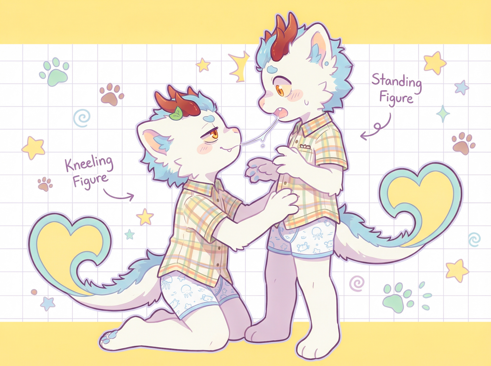
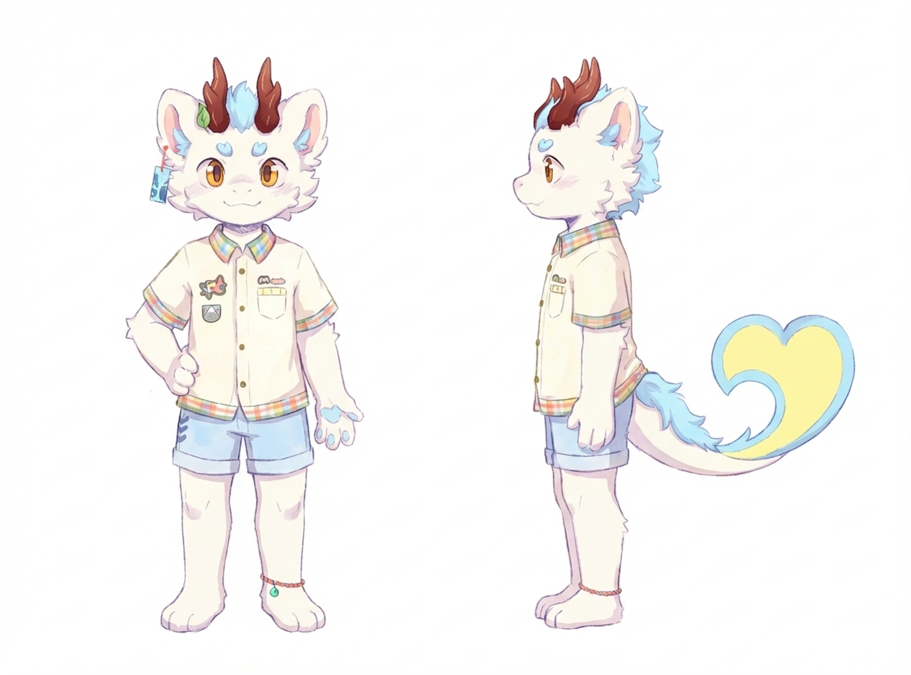
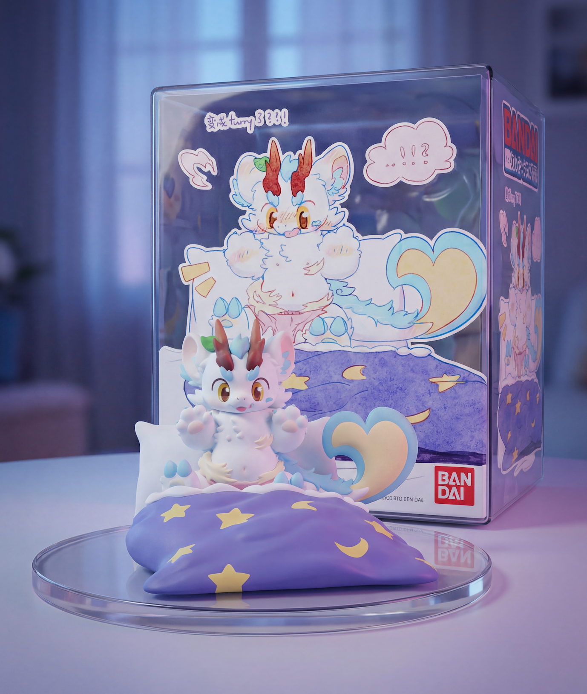
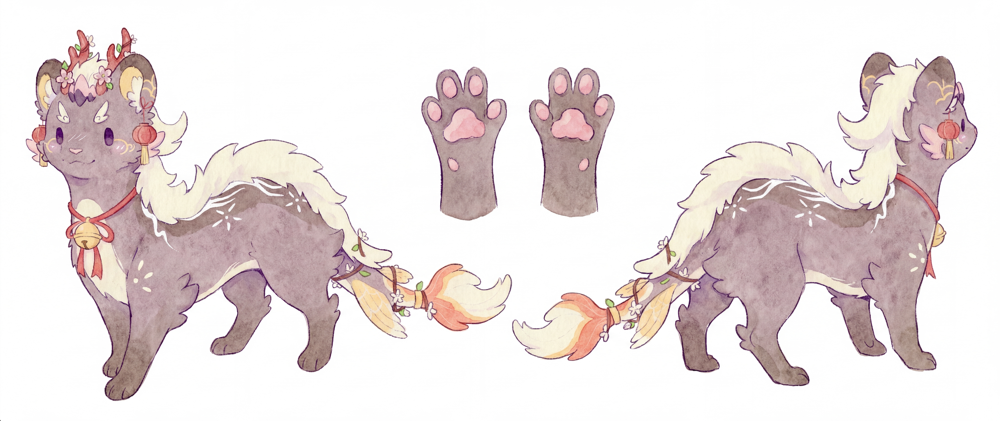
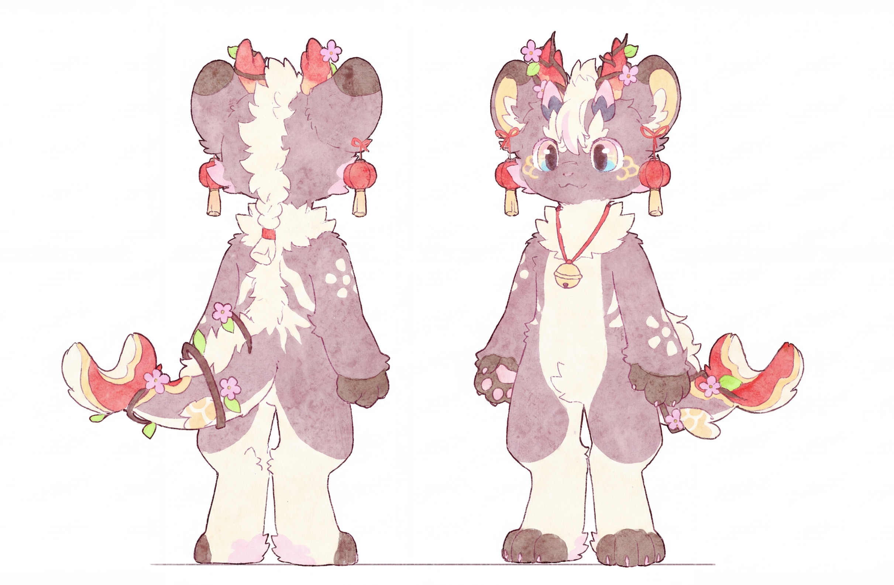
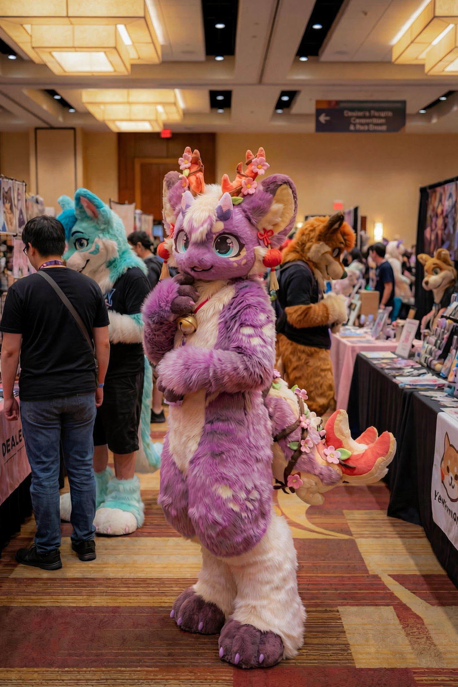

<a id="cases-toc"></a>
## 📖 Cases Directory

*   [No. 1: Mofu Mofu Transformation (Photographer)](#cases-1) 🔴
*   [No. 2: ASCII Art](#cases-2) 🔴
*   [No. 3: Milk Bottle Art](#cases-3) 🔴
*   [No. 4: Milk Carton Advertisement](#cases-4) 🔴
*   [No. 5: Chalk Art on Blackboard](#cases-5) 🔴
*   [No. 6: Galgame Hotspring Scene](#cases-6) 🔴
*   [No. 7: Chibi Teasing Emoji](#cases-7) 🔴
*   [No. 8: Manga Page - Nick Wilde Peanut Butter](#cases-8) 🟢
*   [No. 9: Pastel Chibi Self-Kiss Scene](#cases-9) 🔴
*   [No. 10: Front and Side View Reference Sheet](#cases-10) 🔴
*   [No. 11: PVC Figure Product Showcase](#cases-11) 🔴
*   [No. 12: Front 3/4 and Back 3/4 Reference Sheet](#cases-12) 🔴
*   [No. 13: Back 3/4 and Front 3/4 Reference Sheet (Alternate)](#cases-13) 🔴
*   [No. 14: Kemono Fursuit at Convention](#cases-14) 🔴
*   [No. 15: Visual Novel Screenshot - Shoe POV Sequence](#cases-15) 🔴

---

<a id="cases"></a>
## 🧩 No.

<a id="cases-1"></a>
### No. 1: Mofu Mofu Transformation (Photographer) 🔴

<br>
<sub>Credit: [与纸Yuzhi](https://github.com/Yuzhifur)</sub>


**Prompt**

```
Create a four-step transformation chart showing how the same character evolves from a quadrupedal fluffy creature into a human boy with furry ears.  
Make each step aligned from left to right. Space the four steps tightly rather than loosely, design certain overlapping between them.
Arrange the four figures be front facing, but with different tilts to the left or right, avoid having them all tilted to left or right. For example: [right, left, right, left]
Add a long horizontal arrow at the bottom with tick marks labeled 1, 2, 3, 4 as the legend.  

Include a hanging bookmark tag in the top-left corner with a hand-drawn look, slightly bent, and write in cute handwritten lettering:
"<character_name>'s mofu mofu transformation"
Add a small decorative feather or doodle beside the text.

Step 1:
A fluffy chibi qilin creature walking on all fours. Tiny arms and tiny legs, very round body, no clothing.  
Keep all the essential character traits such as ears and hairstyle.  
Facing the camera with a playful wink expression.  
Very small and low to the ground.

Step 2:
A slightly taller small furry creature. It stands upright on two legs but still has short bendy legs and short chubby arms, retaining a cute compact shape.  
He starts wearing a single piece of clothing on the upper body, but no pants.  
A soft woven toy camera hangs from his chest, but he is not holding it.  
Still fluffy all over.  
Height is slightly taller than Step 1.

Step 3:
A straight-leg furry boy standing upright on fully human-like straight legs, but still furry all over.  
Hands and feet remain paws.  
He now wears both a top and pants.  
A card-type camera hangs from his chest, but he is not holding it.  
He is clearly taller than in Step 2.  
He shows a happy, energetic pose and expression.

Step 4:
A human boy with large furry ears.  
Completely human body and skin except for the ears. No tail.  
Soft light skin tone.  
Fluffy light hair with pastel tones, slightly tousled and cute.  
Large gold bright eyes and an adorable youth style. 
Two wooden horns, with a leaf on one horn, are still present.
He uses one hand to show off a tripod, supporting an intricate and large camera system with an 800mm lens.
He uses another hand to set off a camera drone, which the camera drone has just started and is rising.
He looks into the viewer and smile happily.
Wearing the same clothing, with more intricate decorations and gadgets added to the clothes, including a white and blue belt bag, cute sprinkling whale attached to waist, and a cute little qilin plushie that sits on shoulder.
He is the tallest of all four steps.

---

Soft pastel color palette.  
Cute Japanese-style youthful illustration.  
Clean thin line art, round shapes, and bright expressive eyes.  
Soft lighting with gentle shadows.  
Add small doodle accents such as sparkles, tiny marks, and simple motion lines near the characters.  
Overall warm, fluffy, charming mood with very light textures that resemble soft paper.  
Keep all four steps visually consistent as one character family, matching proportions and hair silhouette.
```

---

<a id="cases-2"></a>
### No. 2: ASCII Art 🔴

<br>
<sub>Credit: [与纸Yuzhi](https://github.com/Yuzhifur)</sub>


**Prompt**

```
Screenshot of a thread from an anonymous bulletin board, featuring a large ASCII art that recreates a character, no color reproduction required and using standard black text color, the ASCII art is expressed solely through a combination of symbols and characters
```

---

<a id="cases-3"></a>
### No. 3: Milk Bottle Art 🔴

<br>
<sub>Credit: [与纸Yuzhi](https://github.com/Yuzhifur)</sub>


**Prompt**

```
Create an art of the character provided in the reference image in a glass milk bottle with simple white background. The character is sitting cross-legged at the bottom of the glass, with one hand supporting off the floor, and the other hand placed closed to his face. He sticks out his tongue with a shy expression. There is a label saying キリンの生牛乳 on the glass bottle.
```

---

<a id="cases-4"></a>
### No. 4: Milk Carton Advertisement 🔴

<br>
<sub>Credit: [TlanoAI](https://x.com/TlanoAI), Prompt modified and art recreated by @与纸Yuzhi</sub>


**Prompt**

```
Create an advertising photo of fresh milk with a half body portrait of the character provided in the first image designed on the packaging. The character is front facing the camera (in this angle the tail can't be seen), with both hands lifting his top clothes just enough to show a bit of white fur belly. Edit the facial expression to be a shy one, head slightly tilted, sticking a tongue out. Featuring character illustrations designed on a 1L paper carton, with glasses filled with milk arranged alongside. Set the background to be at a farm. Label the paper caton with title "キリン生乳"
```

---

<a id="cases-5"></a>
### No. 5: Chalk Art on Blackboard 🔴

<br>
<sub>Credit: [与纸Yuzhi](https://github.com/Yuzhifur)</sub>


**Prompt**

```
Create a realistic photograph of the provided image as a colored chalk art on a blackboard. The blackboard is photographed from an angle, a scene of a modern Japanese classroom, the blackboard is mounted on the wall, there is a teacher's desk in front, and next to the illustration, it is written in chalk "記念日おめでとう!".
```

---

<a id="cases-6"></a>
### No. 6: Galgame Hotspring Scene 🔴

<br>
<sub>Credit: [与纸Yuzhi](https://github.com/Yuzhifur)</sub>


**Prompt**

```
Generate a screenshot from a galgame presented in a cozy, misty night hotspring setting, with the character to interact with be the one provided in the image. The environment is well litted. The character is in the hotspring, sitting closely right in front of the camera, with only the upper half body seen above water. The character is facing towards the camera with a shy expression. The character's (taken off) clothes can be seen behind in the near background. At the very top of the screen is a horizontal relationship/status bar with a heart-themed icon on one side.
Surrounding the character is an array of pixel-art interaction icons. To the left are several interaction buttons arranged vertically and diagonally, including four interacting and touching options. To the right is another cluster of UI icons featuring options for dialogue, affection, item use, and posture changes.
Along the bottom left is a grid of eight selectable body-area icons, each paired with small multi-slot progress indicators beneath them. On the bottom right is a compact status panel showing two separate lines of information: one represents a desire or arousal index, and the other conveys the character's current emotional state.
Across the very bottom of the screen is a dialogue box with rounded corners, containing a line of text spoken by the character: "[なぜだか、さっきあんな風に触られたのがすごく気持ちよかった.]". Write all text in japanese.
```

---

<a id="cases-7"></a>
### No. 7: Chibi Teasing Emoji 🔴

<br>
<sub>Credit: [与纸Yuzhi](https://github.com/Yuzhifur)</sub>


**Prompt**

```
Generate a half body (can only see head ,paws, collar, and part of shoulder) of cute chibi emoji art of this character saying "杂鱼, 杂鱼".

Slightly teasing expression. Eyelids are half-closed, with the brows relaxed into a lazy arc. There's a flushed blush on the cheeks, and the open mouth is curved into a playful, taunting laugh.

Hand Position:
One hand is lifted near the mouth, covering it partially in a coy, "hehe-I-know-something" gesture. The fingers are curved inward softly, as if the character is giggling behind their hand.

---

Soft pastel color palette.
Cute Japanese-style youthful illustration.
Clean thin line art, round shapes, and bright expressive eyes.
Soft lighting with gentle shadows.
Add small doodle accents such as sparkles, tiny marks, and simple motion lines near the characters.
```

---

<a id="cases-8"></a>
### No. 8: Manga Page - Nick Wilde Peanut Butter 🟢

<br>
<sub>Credit: [Toynya](https://x.com/wanjumiao65535)</sub>


**Prompt**

```
【畫面基礎設定】

媒介 (Medium): 日本漫畫頁面 (Japanese Manga Page)，同人誌風格 (Doujinshi style)，黑白 (B&W)，單色 (Monochrome)，灰階 (Grayscale)。

藝術風格 (Art Style): Kemono style (日系獸人), Kemoshota style (可愛少年獸人風格 - 圓潤、大眼、毛茸茸), Screentones (網點/漫畫陰影), Inked lineart (墨線), Halftone pattern (半色調), High contrast.

人物比例 (Proportions): 4~5 頭身 (low head-to-body ratio), Cute & Round features (可愛圓潤的特徵), Fluffy texture (毛絨質感).

【角色外觀】

角色: 尼克·王爾德 (Nick Wilde)。

特徵修正: 一隻擬人化的狐狸，身穿夏威夷襯衫  (Hawaiian shirt)、牛仔短褲，腳掌赤裸，表情慵懶且輕浮。雖然是成年人，但請畫成「正太系獸人 (Kemoshota)」的可愛模樣。大大的尖耳朵，短短的吻部 (short muzzle)，大眼睛，更加毛茸茸的手掌和肉球 (Paws and pawpads)。

【漫畫佈局要求】
請將頁面分為 4-5 個不規則分鏡 (Panels)，分鏡之間要有重疊 (Overlapping panels) 或共用邊界。包含切入式特寫 (Cut-in shots)、對話氣泡 (Speech bubbles)、內心獨白方塊 (Monologue boxes) 和擬聲詞 (SFX)。

【詳細分鏡內容】
分鏡 1 (頂部，寬畫面 - 淡入效果)：

畫面： 尼克半躺在凌亂的沙發上，電視的光映在他臉上。他一隻手拿著手機貼在毛茸茸的耳朵邊，眼神迷離帶著笑意。

對話氣泡 (Nick)： 「よう、ニンジン。俺がいなくて寂しいか？今夜のパトロールは退屈だろ？」

特效 (Emanata)： 手機周圍有微微的振動線條。

分鏡 2 (中部左側，重疊邊框)：

畫面： 中景鏡頭。尼克一邊講電話，一邊將另一隻手深深伸進一個巨大的「花生醬罐子」裡。

對話氣泡 (Nick)： 「俺？あー...今取り込み中なんだ。『甘い』デートの最中でね。」

內心獨白 (方塊)： このピーナッツバター、まさに天国だ...

分鏡 3 (中部右側，圓形內嵌面板 Inset Panel)：

畫面： 特寫鏡頭 (Close-up)。尼克的手指從罐子裡抽出來，上面沾滿了濃稠、金黃色的花生醬，正在滴落。

擬聲詞 (SFX)： ヌチャ... (Squelch) / トロ... (Sticky)。

分鏡 4 (底部，最大的主視覺 - 切入式面板)：

畫面： 極具張力的特寫。尼克閉著一隻眼睛，臉頰微紅 (Blush lines)，舌頭伸出來，津津有味地舔舐手指上的花生醬。表情色氣且享受。

對話氣泡 (Nick)： 「んん... 濃厚でいい香りだ。ジュディ、お前にも味わわせてやりたいぜ。」

特效： 周圍飄著愛心符號或表示美味的小花朵。

分鏡 5 (角落小格 - 旁白或通話對面)：

畫面： 手機屏幕特寫或對話框突出。

對話氣泡 (Judy - 電話聲)： 「ニック！！また高カロリーなジャンクフード食べてるんでしょ！？」

內心獨白 (Nick)： バレたか。
```

---

<a id="cases-9"></a>
### No. 9: Pastel Chibi Self-Kiss Scene 🔴

<br>
<sub>Credit: [与纸Yuzhi](https://github.com/Yuzhifur)</sub>


**Prompt**

```
Generate an art of the furry boy in the provided image kissing a duplicate of himself.
Here are the pose and style requirements:
A dynamic composition where both figures are extremely closed up, with one figure kneels while the other stands, their faces meeting at an angle where their lips have just separated. A thin, glistening strand of saliva connects them in the frozen instant. Their expressions burst with playful intensity: the kneeling figure looking up with a satisfied smile and half-closed eyes, the standing figure gazing downward with a blush and shyness, breathless softness. The kneeling figure has one hand resting on the standing figure's hip, the other lightly brushing against the standing figure's forearm. The standing figure's hands float mid-air, one reaching as if about to cradle the kneeling figure's cheek. The pose is full of motion even in stillness.
A playful, pastel-colored illustration drawn with a soft, cartoony aesthetic. The lineart is clean, slightly thick, and uniformly smooth. Colors consist of gentle pastels: clean whites, cool greens, dusty purples, soft yellows, and muted browns. Shading is minimal, using flat tones with very light, subtle shadows. Highlights are sparse or stylized rather than realistic. The characters have simplified, expressive faces with exaggerated eyes and small mouths, giving a cute, humorous tone. Anatomy is intentionally stylized, with round heads, compact bodies, and chibi-like proportions. Fur is indicated using simple zigzag or tuft shapes rather than detailed texture.
The background features a grid pattern drawn with thin, light lines, giving a notebook or sketchpad aesthetic. Over the grid, there are playful doodles scattered around: paw prints, stars, random scribbles, abstract swirls, and tiny icons that add energy without clutter. A large rectangular section of solid pastel yellow occupies the top and bottom of the canvas, creating a banded layout that frames the characters. The overall composition feels like a character sheet or playful catalog page. Text labels in a loose, handwritten font appear near each character, adding a casual, illustrative charm. The entire piece has an energetic, whimsical mood, cohesive color harmony, and a soft, friendly visual atmosphere.
```

---

<a id="cases-10"></a>
### No. 10: Front and Side View Reference Sheet 🔴

<br>
<sub>Credit: [与纸Yuzhi](https://github.com/Yuzhifur)</sub>


**Prompt**

```
Create a "Front and Side View" reference illustration of the character provided in the image. Follow these guidelines:

# The Neutral Front View:
- Viewpoint: Full-body front view
- Body Posture: Standing perfectly straight with a neutral posture. The head faces directly forward.
- Legs: Legs are naturally standing straight and together. The feet rest flatly on the ground, aligned with the shoulders.
- Arms: Arms are naturally rested at the two sides of the body, with the left palm facing inward towards hips, and right plan facing forward towards the viewer.
- Overall perfect symmetry, no tail to be seen.
- Placed at the left side in the illustration

# The Neutral Side View:
- Viewpoint: Full-body profile view (side view)
- Body Posture: Maintains a straight, vertical alignment from head to toe.
- Head/Neck: The head is held level, looking straight ahead in the profile direction.
- Legs: The legs are naturally standing straight and together. No bent knees. Feet rest flatly on the ground.
- Arms: The are naturally rested at the two sides, hanging straight down along the body's midline.
- Tail: naturally rested.
- Placed at the right side in the illustration

Finally, use white background, use no labels or text, remove any watermarks, and keep character details and style true to original.
```

---

<a id="cases-11"></a>
### No. 11: PVC Figure Product Showcase 🔴

<br>
<sub>Credit: [与纸Yuzhi](https://github.com/Yuzhifur)</sub>


**Prompt**

```
Create an image that shows the characters in the provided image placed at the center of a softly lit indoor setting. The figure is made of smooth, painted PVC-like material. It is displayed on a transparent circular acrylic base.

Behind the character, there is a BANDAI-style plastic toy packaging box printed with the artwork.

The background environment is a soft-focus indoor room with cool lighting. Depth of field is shallow, keeping only the figure and the packaging sharply focused while the rest of the room blurs smoothly.

The overall image feels like a product showcase photograph: neutral ambient lighting, soft shadows, and smooth gradients emphasize the materials and craftsmanship of the character in the provided image.
```

---

<a id="cases-12"></a>
### No. 12: Front 3/4 and Back 3/4 Reference Sheet (Feral) 🔴

<br>
<sub>Credit: [与纸Yuzhi](https://github.com/Yuzhifur)</sub>


**Prompt**

```
Create a "Front 3/4 and Back 3/4" reference illustration of the character provided in the image. Follow these guidelines:
# The Neutral Front Three-Quarter View (placed on the left):
* Viewpoint: full-body front three-quarter angle; the body is angled about 20–30° so both the chest and part of the side are visible.
* Overall posture: a neutral, calm slow-walk posture. The spine is straight and level, head held naturally raised.
* Head: facing directly toward the viewer despite the body being angled; facial direction is centered, not turned.
* Front legs: positioned in a natural slow-walk stance. One front leg is slightly ahead of the other, but both remain relaxed with paws resting flat on the ground. No stiff soldier stance.
* Hind legs: also in slow-walk alignment, with one hind leg slightly behind the other. The toes touch the ground naturally, no splay.
* Paws: fingers relaxed, no gripping or tension.
* Tail: neutral, gently lowered or softly flowing behind in a resting alignment, not curled or expressive.
* Expression: neutral and calm.
* Placement: left side of the illustration.
# The Neutral Back Three-Quarter View (placed on the right):
* Viewpoint: full-body back three-quarter angle; the back and hips are the primary view, with a portion of the side and shoulder visible.
* Overall posture: same neutral slow-walk continuity as the front view, as if the feral moment is frozen mid-step.
* Head: turned slightly toward the viewer so part of the face is visible, but still clearly oriented from behind.
* Front legs: natural slow-walk placement visible from the back angle, with paws angled outward slightly as real quadrupeds do. No parallel columns.
* Hind legs: one slightly forward, one slightly behind, with hocks and paws visible clearly from behind. Keep grounded and relaxed.
* Tail: relaxed, resting along the natural curve of the spine; visible but not expressive.
* Expression: neutral and calm.
* Placement: right side of the illustration.
# Central Paw Reference (placed between the two views):
* Two disembodied front paws (up to the wrist only) shown as a pair.
* Orientation: facing the viewer directly and symmetrically.
* Paw beans: clearly visible and centered; fingers gently spread, relaxed, with no exaggerated curvature.
# General requirements:
* White background. No labels, text, icons, watermarks, props, objects, or environmental elements.
* Mostly symmetrical for left and right due to both being three-quarter tilt. Differ in details.
* Keep character details and style true to original
* Keep scale consistent across all three components.
```

---

<a id="cases-13"></a>
### No. 13: Back 3/4 and Front 3/4 Reference Sheet 🔴

<br>
<sub>Credit: [与纸Yuzhi](https://github.com/Yuzhifur)</sub>


**Prompt**

```
Create a "Front 3/4 and Back 3/4" reference illustration of the character provided in the image. Follow these guidelines:

# Left — Back Three-Quarter Tilt (placed left):
* Viewpoint: full-body, back three-quarter tilt — body turned so the back is mostly visible while the far shoulder and a small portion of the front are slightly visible (about 20–30° turned toward the viewer).
* Posture: standing straight with a neutral, relaxed spine; weight evenly distributed on both feet.
* Head: turned slightly toward the viewer so the face is visible at a subtle three-quarter angle (no dramatic tilt).
* Arms: hanging naturally at the sides, relaxed; hands at hip level, palms neutral (not clenched).
* Legs: standing straight and together, knees unbent, feet flat on the ground and parallel.
* Expression/attitude: neutral, relaxed.
* Placement: left side of the sheet.
# Right — Front Three-Quarter Tilt (placed right):
* Viewpoint: full-body, front three-quarter tilt — body turned so the front is mostly visible while the far side recedes slightly (about 20–30° turned away from the viewer).
* Posture: standing straight with neutral alignment; shoulders level.
* Head: facing slightly toward the tilt (subtle three-quarter view), eyes looking forward.
* Arms: naturally rested at the two sides, relaxed; left palm may face inward toward the hip, right palm may face slightly forward — keep both hanging straight.
* Legs: standing straight and together, knees unbent, feet flat and parallel.
* Expression/attitude: neutral, relaxed.
* Placement: right side of the sheet.
# General requirements:
* White background; no labels, text, watermarks, props, or extra objects.
* Mostly symmetrical for left and right due to both being three-quarter tilt. Differ in details.
* Keep character details and style true to original.
* Keep both figures the same scale and aligned to the same ground line for easy comparison.
```

---

<a id="cases-14"></a>
### No. 14: Kemono Fursuit at Convention 🔴

<br>
<sub>Credit: [与纸Yuzhi](https://github.com/Yuzhifur)</sub>


**Prompt**

```
A realistic photograph of the furry character from the provided reference image turned to a kemono style fursuit, standing in an aisle in a furry convention.
```

---

<a id="cases-15"></a>
### No. 15: Visual Novel Screenshot - Shoe POV Sequence 🔴

<br>
<sub>Credit: Original Inspiration from 云阁, prompt devised by [与纸Yuzhi](https://github.com/Yuzhifur)</sub>


**Prompt**

```
Create a single high-resolution vertical composite made of two sequential visual-novel style screenshots stacked one above the other, each framed inside a white desktop application window (Windows-like title bar with tiny minimize/close icons, the Chinese window title '家有兽人' visible in the top-left of each window). Keep the two windows centered, separated by a thin gap, and show subtle drop shadows so they read as separate windows on the same canvas.

---

# TOP SCREENSHOT (upper window)

Camera & perspective: The camera is placed inside one of the character's sports shoes, pointing upward through the shoe opening toward the sky. It reads as a true interior POV: you can see the textured shoe lining and circular rim framing the shot. The nearest object is the character's paw moving down into the shoe — enormous and heavily foreshortened by the extreme close-up, pads and small dirt smudges visible in stark detail. The rest of the limb and body tower above the lens and sit slightly out of focus because of the very shallow depth of field; daylight from above backlights the edges, creating a bright rim and soft highlights on fur/fabric while the far background (blue sky and clouds) stays crisp but secondary. This is literally the instant before the character slides the paw into the shoe.

Foreground object: the character's raised foot is pushed close to the lens, almost filling the frame. The sole is muddy and textured, visible dirt smudges and creases; the toes/pads read as close, tactile forms. Surrounding the circular frame is textured fabric rim (like the inside of a shoe or tunnel) with visible weave and soft shadows.

Midground/background: the rest of the character is standing above, slightly out of focus due to shallow depth of field. A bright blue sky with soft white clouds provides a clean background. Warm rim light and daylight soft shadows.

UI/overlays: a semi-transparent black dialogue box runs across the bottom of this window. On the left of the dialogue box is a small chibi-style portrait of the character and a blue name label. There are two dialogue choice lines displayed inside the box; one of the choices is highlighted. All text is in Chinese (render realistic Chinese characters). Keep the textbox style typical of modern VN: subtle inner glow, thin border, and a faint downward chevron indicating more text.

# LOWER SCREENSHOT (lower window)

Camera & perspective: medium three-quarter view (about knee-to-head framing) at eye level relative to the seated character on a running track. Slight telephoto compression so the background stadium bleachers and field feel slightly compressed.

Pose & action: the character is seated on the outer lane of a running track, one leg extended forward with the shoe partially removed; the character is holding the shoe and looking down at their foot/shoe with a surprised/confused expression. The shoe (foreground) shows a dirt-streaked sole and sits partly facing the viewer.

Environment: an outdoor school stadium scene — red running track lanes, green field, distant bleachers, trees and low buildings under a clear sky. A few other furry boys are visible jogging along the track in the background. Late-afternoon warm sunlight produces long soft shadows and mild lens flare/bloom near the top-left, creating a gentle golden rim on the character and shoe.

UI/overlays: another semi-transparent black dialogue box overlays the bottom of this window with the same chibi portrait and name label at its left. In the top-right corner of this lower window, show a small in-game achievement banner in Chinese displaying the ending name '无情的脏爪'. Keep the window chrome consistent with the top screenshot.

---

# ART STYLE & RENDERING

Overall style: high-quality anime / stylized illustration with crisp linework and soft cel-shading blended with painterly, highly detailed backgrounds. Smooth gradients, subtle painterly brushwork for the sky and track textures, and delicate rim lighting on edges.

Lighting & optics: natural daylight with warm late-afternoon tones, subtle bloom, shallow depth of field (strong bokeh on foreground elements in the top shot), and realistic surface textures (fabric weave inside the circular rim, rubber/leather textures on the shoe sole).

Color palette: predominantly sky-blue and white for clothing/foreground highlights, warm golden sunlight, red track lanes, and green field background. Keep saturation vivid but balanced.

Narrative continuity: visually connect the two windows as sequential moments of the same scene — the top frame captures the moment the character stepped/raised their foot over the camera (or shoe interior), while the lower frame shows the immediate aftermath: the character sitting on the track taking off/inspecting the shoe. Make the two panels read as one short story beat.

---

# Screenshot Logic (what's actually happening)

Top window — POV shot inside the shoe: This is the moment the story/player chooses the action to put the shoe on. The image is from inside the shoe, showing the approaching paw and the shoe's inner fabric rim. A dialogue box with a highlighted choice sits at the bottom — that choice represents the player/character selecting to wear the shoe (or a similar action). The dirty sole/pads visible here will correspond to the shoe seen later.

Lower window — immediate aftermath / consequence: The scene has advanced to the character sitting on the track with the shoe now on (or recently adjusted). The character is examining the shoe/foot with a surprised/confused expression; the same shoe (with matching dirt patterns) appears in the foreground, confirming continuity between the two panels.

---

# ADDITIONAL NOTES

Include small, realistic OS window details (title bar, thin border, and subtle shadow).

Keep the composition crisp and cinematic, with the extreme close-up wide-angle top shot contrasting the calmer mid-shot below, and ensure both dialogue boxes contain Chinese text and the same chibi portrait to make the two images clearly part of the same visual novel interface.
```


[⬆️ Back to Cases Directory](#cases-toc)

---


